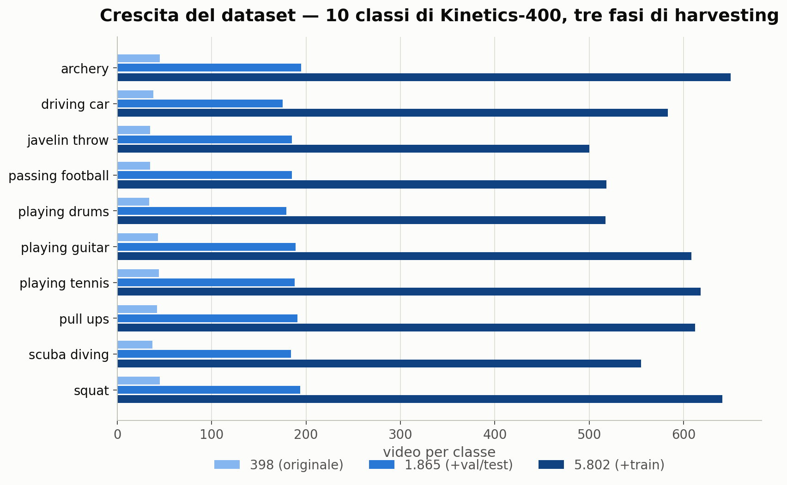
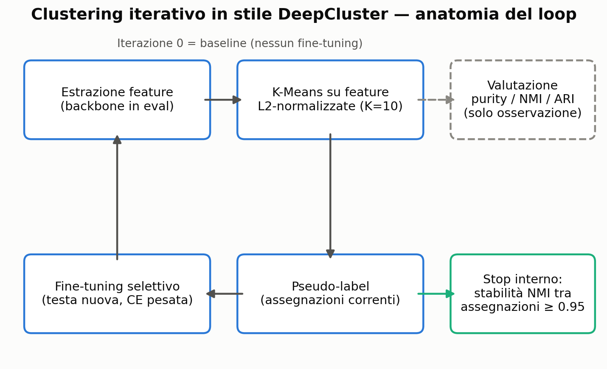
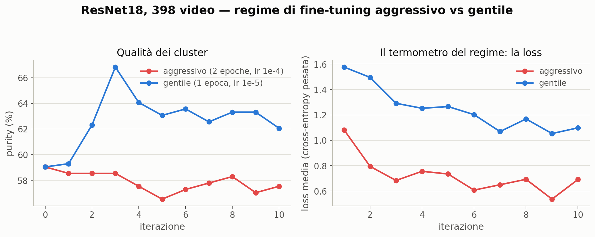
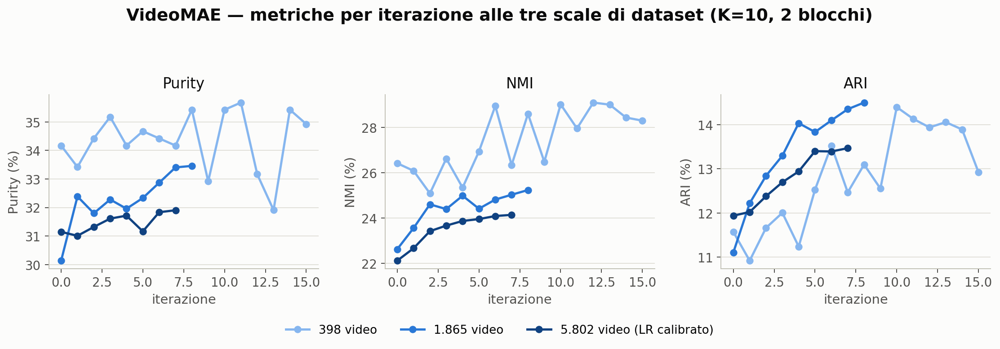
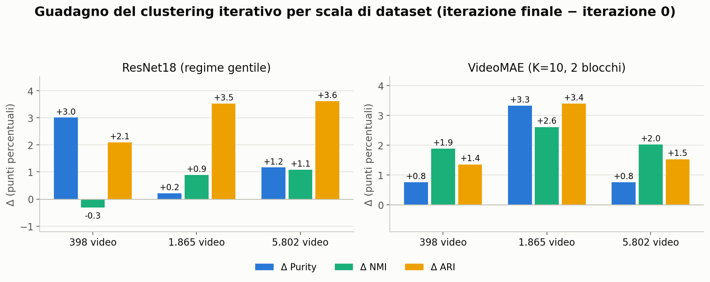
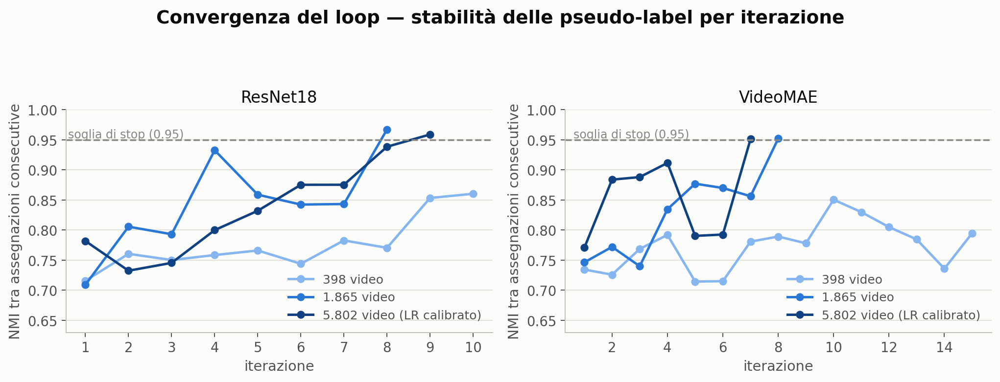
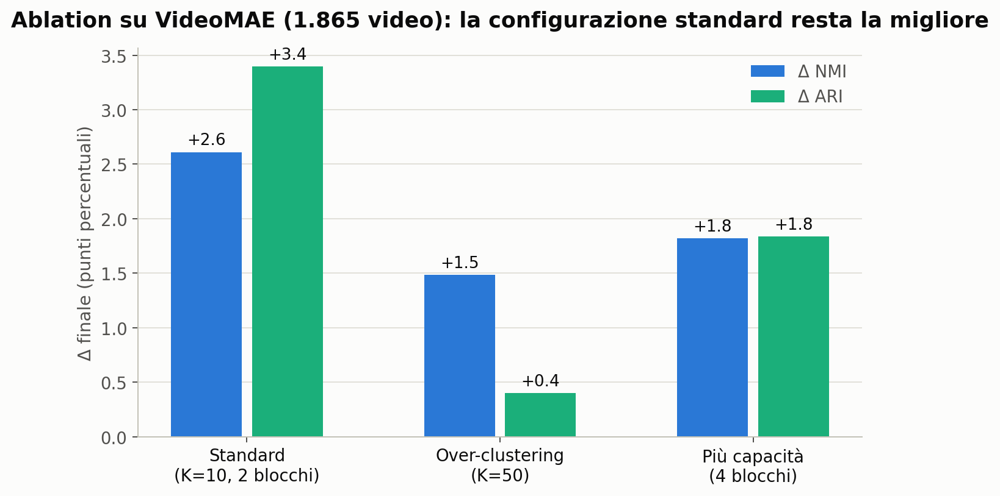

# Clustering-based SSL for Action Discovery
- **Gruppo**: DataMinds (Lorenzo Comis, Alessandro Sciacca)
- **Progetto**: Track 12: Clustering-based SSL for Action Discovery

---

## 1. Introduzione e obiettivo

Il progetto affronta la **Action Discovery non supervisionata** in video: dato un insieme di clip senza alcuna annotazione, l'obiettivo è far emergere raggruppamenti che corrispondano ad azioni ricorrenti, usando le etichette reali **esclusivamente come chiave di valutazione a posteriori**, mai durante il training. La traccia fissa quattro obiettivi minimi: una baseline K-Means su feature ResNet18, l'estrazione di feature con un modello self-supervised (VideoMAE), un **K-Means iterativo** in cui il clustering e la rappresentazione si migliorano a vicenda, e la valutazione tramite corrispondenza con le classi reali.

La domanda centrale che ci siamo posti è questa: *il fine-tuning iterativo guidato da pseudo-label può rendere clusterizzabili delle rappresentazioni che non nascono per esserlo?* Le feature di ResNet18 (supervisionate su ImageNet) partono già semanticamente organizzate; quelle di VideoMAE (pre-training di ricostruzione mascherata) no. Il clustering iterativo in stile DeepCluster promette di colmare questo tipo di divario, ma è nato per milioni di immagini, il compito sarà quello di adattarlo anche ai video.

## 2. Contributi e valore aggiunto

Oltre all'implementazione completa della pipeline richiesta dalla traccia, il progetto porta questi contributi:

1. **Uno studio di scaling a tre punti** (398 → 1.865 → 5.802 video), reso possibile dall'estensione autonoma del dataset dagli archivi ufficiali di Kinetics-400: è l'esperimento che ha trasformato un risultato negativo in una comprensione del comportamento del metodo.
2. **Fine-tuning dinamico adattato al dataset**: il regime di fine-tuning va scalato con la dimensione del dataset (in numero di update, non di epoche), dimostrato con controfattuali su entrambi i backbone.
3. **Utilizzo della L2-normalization**: la sola L2-normalization delle feature prima del K-Means vale **+8,5 punti di purity** sulla baseline ResNet.

## 3. Dati utilizzati

Il punto di partenza è un sottoinsieme di **Kinetics-400** con 10 classi di azione (*archery, driving car, javelin throw, passing American football, playing drums, playing guitar, playing tennis, pull ups, scuba diving, squat*): **398 video** (~35–45 per classe), organizzati come `data/<classe>/*.mp4`. Da ogni video vengono campionati **16 frame uniformi**, ridimensionati a 224×224.

Il dataset è cresciuto due volte nel corso del progetto (il capitolo 5 ne racconta le ragioni). Quando i primi esperimenti hanno indicato in 398 campioni il probabile collo di bottiglia del metodo, lo abbiamo esteso attingendo agli **archivi ufficiali** di Kinetics-400. La prima estensione (split *val* e *test*) porta il dataset a **1.865 video**; la seconda (split *train*) a **5.802 video**.

**Tabella 1: Le tre fasi del dataset**

| Fase | Video totali | Per classe | Provenienza |
| :--- | :---: | :---: | :--- |
| Iniziale | 398 | 34–45 | selezione dallo split *train* |
| Prima estensione | 1.865 | 175–195 | + split *val* e *test* ufficiali |
| Seconda estensione | 5.802 | 500–650 | + split *train* (stop a quota 500/classe) |

Due note metodologiche:
- Mescolare gli split di Kinetics è legittimo nel nostro contesto: non c'è un addestramento supervisionato con train/test da separare, le etichette servono solo a valutare. Nessuna sovrapposizione tra le fasi (verificato: i 398 video originali provengono tutti dallo split *train*).
- Come preprocessing, i frame decodificati vengono cachati su disco in `uint8` una sola volta; la **data augmentation** (flip orizzontale e random resized crop, campionati una volta per clip e applicati identici a tutti i 16 frame per preservare la coerenza temporale) è applicata solo durante il fine-tuning, mai in fase di estrazione feature.

## 4. Metodologia e architettura

### 4.1 Estrazione delle feature e baseline

Due backbone estraggono una rappresentazione per video: **ResNet18** pre-addestrata su ImageNet e **VideoMAE-base** pre-addestrato con masked autoencoding. La baseline è un singolo K-Means con K=10 (pari al numero di classi, assunzione dichiarata) sulle feature così estratte.

La valutazione usa tre metriche complementari, calcolate da un unico modulo condiviso tra baseline e metodo iterativo: **purity** (frazione di campioni coerenti con la classe maggioritaria del proprio cluster; cresce meccanicamente con K), **NMI** (informazione mutua normalizzata, robusta al numero di cluster) e **ARI** (indice di Rand corretto per il caso, severo verso i cluster spezzati).

### 4.2 Il loop iterativo

Il metodo segue lo schema DeepCluster: le assegnazioni del K-Means corrente diventano **pseudo-label** per un breve fine-tuning del backbone; con il backbone aggiornato si riestraggono le feature e si ri-clusterizza. L'**iterazione 0** (K-Means sulle feature pre-addestrate, prima di ogni fine-tuning) coincide per costruzione con la baseline, il che rende ogni curva confrontabile col punto di partenza. Presentiamo alcune delle decisioni prese riguardo l'architettura dei metodi:

- **Clustering**: K-Means su feature **L2-normalizzate**, K=10 fisso.
- **Fine-tuning selettivo**: con pochi dati e pseudo-label rumorose, adattare tutto il backbone distruggerebbe il pre-training. Si sbloccano solo i layer semantici alti: **layer4** per ResNet18 e gli **ultimi 2 blocchi** encoder per VideoMAE.
- **Anti-collasso**: cross-entropy **pesata con l'inverso della dimensione dei cluster** (senza, i cluster grandi dominano il gradiente e degenerano); le dimensioni dei cluster sono monitorate a ogni iterazione.
- **Criterio di stop interno**: il loop si ferma quando la NMI **tra le assegnazioni di due iterazioni consecutive** supera 0,95, con un tetto massimo di iterazioni.

### 4.3 Infrastruttura di calcolo

Il progetto è iniziato sul portatile di uno di noi (solo CPU): lì sono nate la pipeline, le verifiche e i primi run ResNet (~2 ore l'uno). Per VideoMAE un singolo run completo avrebbe richiesto ~15 ore stimate: siamo quindi passati al **cluster GPU del DMI**, adattando la pipeline ai suoi vincoli reali: nodi senza accesso a Internet e un job per utente alla volta.

**Tabella 2: Tempi misurati, portatile vs cluster**

| Operazione | Portatile (CPU) | Cluster (L40S) |
| :--- | :---: | :---: |
| Run iterativo ResNet, 398 video | ~2 h | ~8 min |
| Run iterativo VideoMAE, 398 video | ~15 h (stima) | 9 min |
| Run iterativo VideoMAE, 1.865 video | impraticabile | 22 min |
| Run iterativo VideoMAE, 5.802 video (15 iter.) | impraticabile | ~2 h |

---

## 5. Risultati e discussione

Gli esperimenti sono presentati nell'ordine in cui sono avvenuti: ogni passo è motivato dall'esito del precedente.

### 5.1 Baseline, e una scoperta di L2-normalization

**Tabella 3: Baseline sul dataset iniziale (398 video, K=10). La colonna Δ mostra l'effetto della sola L2-normalization sulla purity, a parità di tutto il resto.**

| Backbone | Feature | Purity | Δ Purity | NMI | ARI |
| :--- | :--- | :---: | :---: | :---: | :---: |
| ResNet18 | grezze | 0.5050 | | 0.4898 | 0.3024 |
| ResNet18 | **+ L2-norm** | **0.5905** | **+8,5** | 0.5571 | 0.4013 |
| VideoMAE | grezze | 0.3367 | | 0.2642 | 0.1176 |
| VideoMAE | + L2-norm | 0.3618 | +2,5 | 0.2719 | 0.1274 |

Due fatti. Primo: la sola **L2-normalization** vale **+8,5 punti di purity** su ResNet, riorganizzando uno spazio già semanticamente strutturato; su VideoMAE, dove la struttura di partenza manca, l'effetto c'è ma è tre volte più piccolo (+2,5). Secondo: tra le due configurazioni con L2-norm il divario tra i backbone è di **~23 punti** (0.5905 contro 0.3618), e non è un difetto di implementazione: il pre-training di ricostruzione mascherata ottimizza il modello a *ricostruire*, non a *separare*. Ridurre questo divario senza etichette è la sfida dell'obiettivo 3 della consegna.

### 5.2 ResNet iterativo: due approcci diversi

*Come leggere il grafico: ogni punto è un'iterazione del ciclo (clustering → addestramento → re-clustering), uguale per entrambe le linee; le epoche misurano quanto addestramento avviene dentro ciascuna iterazione. Le due linee partono dallo stesso valore (stessa baseline) e differiscono solo per l'intensità dell'addestramento. Il run rosso si allena il doppio a ogni iterazione, eppure peggiora: la loss molto bassa (pannello destro) rivela che sta memorizzando le pseudo-label, errori compresi.*

A ogni iterazione la rete viene addestrata sui cluster correnti come se fossero etichette vere, ma i cluster correnti sono in parte sbagliati: quanto intensamente addestrarla è la scelta decisiva. Nel primo run (in rosso, 2 epoche per iterazione, learning rate 10⁻⁴) l'addestramento era troppo intenso: la rete imparava le pseudo-label quasi alla perfezione, **errori compresi**, come dimostrava la loss che crollava sotto 0,5. Memorizzare i cluster attuali non crea struttura nuova: al re-clustering successivo la partizione cambiava ogni volta senza migliorare, e la purity finale è scesa sotto la baseline.

Con un addestramento dieci volte più leggero (in blu, 1 epoca, learning rate 10⁻⁵), lo stesso identico loop ha cambiato comportamento: a ogni iterazione la rete assorbe solo i pattern condivisi da molti video (statisticamente quelli corretti) e non fa in tempo a memorizzare i singoli errori. Risultato: purity da 0.5905 a **0.6206** (+3,0 punti), ARI +2,1, e cluster sempre più stabili di iterazione in iterazione. Da questo esperimento abbiamo ricavato due strumenti usati in tutto il resto del progetto: **la loss di training come spia** (troppo bassa significa memorizzazione, non apprendimento) e la regola pratica *tante iterazioni brevi, meglio di poche lunghe*.

### 5.3 VideoMAE a 398 video: un risultato negativo

Sullo stesso dataset il loop non ha smosso VideoMAE: +0,8 punti di purity e stabilità ferma tra 0,71 e 0,85 per 15 iterazioni, senza mai convergere. Il training funzionava (loss in discesa regolare) e i cluster non collassavano. L'ipotesi più fondata era la scala (DeepCluster opera su 1,3 milioni di immagini, noi su 398): da qui la prima estensione del dataset.

### 5.4 Lo studio di scaling: il metodo al variare del dataset

Per verificare l'ipotesi della scala abbiamo rieseguito lo stesso identico esperimento a tre taglie di dataset: 398, 1.865 e 5.802 video. Una premessa di lettura: i valori assoluti **non si confrontano tra taglie diverse**, perché ogni dataset è un compito a sé (più video significa più varietà, e infatti le baseline scendono); il confronto onesto è *dentro* ogni taglia, tra punto di arrivo e punto di partenza (la colonna **Δ = finale − iterazione 0** delle tabelle).

*Come leggere il grafico: un pannello per metrica; asse x = iterazione del loop, asse y = qualità dei cluster; una linea per taglia di dataset. Conta la forma di ogni linea, non l'altezza: se sale, il loop sta migliorando i cluster su quel dataset. Le linee finiscono a iterazioni diverse perché il loop si ferma da solo quando converge.*

| Scala | Iter. 0 (P/NMI/ARI) | Finale (P/NMI/ARI) | Δ (punti) | Stop |
| :--- | :---: | :---: | :---: | :--- |
| 398 | 0.342 / 0.264 / 0.116 | 0.349 / 0.283 / 0.129 | +0.8 / +1.9 / +1.4 | tetto (15) |
| 1.865 | 0.301 / 0.226 / 0.111 | 0.335 / 0.252 / 0.145 | **+3.3 / +2.6 / +3.4** | **convergenza (8)** |
| 5.802 | 0.311 / 0.221 / 0.119 | 0.319 / 0.241 / 0.135 | +0.8 / +2.0 / +1.5 | convergenza (7) |

**Tabella 5: ResNet18 alle tre scale (regime gentile; Δ = finale − iterazione 0)**

| Scala | Iter. 0 (P/NMI/ARI) | Finale (P/NMI/ARI) | Δ (punti) | Stop |
| :--- | :---: | :---: | :---: | :--- |
| 398 | 0.591 / 0.557 / 0.401 | 0.621 / 0.554 / 0.422 | +3.0 / −0.3 / +2.1 | tetto (10) |
| 1.865 | 0.597 / 0.533 / 0.381 | 0.600 / 0.542 / 0.416 | +0.2 / +0.9 / +3.5 | convergenza (8) |
| 5.802 | 0.596 / 0.521 / 0.385 | 0.607 / 0.532 / 0.422 | +1.2 / +1.1 / +3.6 | convergenza (9) |

*Come leggere il grafico: ogni barra è il guadagno netto del loop (finale − iterazione 0) in punti percentuali. Nel pannello VideoMAE le barre salgono da 398 a 1.865 e si riabbassano a 5.802.*

*Come leggere il grafico: misura quanto i cluster cambiano tra un'iterazione e la successiva (1,0 = partizione identica alla precedente), senza usare le etichette vere. Una linea che sale verso la soglia tratteggiata (0,95) indica che il loop si sta assestando; toccarla significa fermarsi da soli. Le linee dei 398 video non la raggiungono mai.*

Il primo risultato arriva a **1.865 video**: il loop che a 398 girava a vuoto ora funziona, migliora tutte le metriche (Δ +3,3/+2,6/+3,4; l'ARI, la più severa, del 30% relativo) e per la prima volta **converge autonomamente** all'iterazione 8, segno che ha trovato una partizione stabile.

Il terzo punto ha richiesto un passaggio in più, diventato un risultato a sé. A **5.802 video** con le stesse impostazioni, la dinamica del loop è degenerata su entrambi i backbone: ResNet è peggiorato nelle metriche (Δ purity −1,0), VideoMAE ha perso la convergenza (tetto a 15 iterazioni) pur mantenendo guadagni positivi. Il motivo è il fenomeno del paragrafo 5.2 sotto altra forma: "1 epoca" su un dataset 3 volte più grande significa il triplo di aggiornamenti dei pesi per iterazione, quindi l'addestramento era tornato troppo intenso senza che avessimo cambiato nulla. **L'intensità dell'addestramento va misurata in numero di update, non di epoche.** Riducendo il learning rate del backbone dello stesso fattore di crescita del dataset (÷3), la convergenza è tornata su entrambi i backbone; per VideoMAE al prezzo di guadagni finali un po' più bassi del run non calibrato: la calibrazione ha comprato la stabilità della soluzione, non Δ più alti (i run non calibrati restano nel registro come controprova).

Con l'addestramento sistemato, il verdetto è pulito: **il beneficio del loop su VideoMAE ha il suo massimo attorno a ~2.000 video e poi satura** (+0,8 di purity a 5.802 contro +3,3 a 1.865). Più dati accendono il metodo, ma oltre una certa soglia non lo spingono più su.

### 5.5 Approfondimento sul dataset intermedio

Sulla scala intermedia abbiamo testato le due leve che avrebbero potuto spingere VideoMAE più su. **Over-clustering (K=50)**, ingrediente canonico di DeepCluster: da noi frammenta senza guadagnare: con ~37 video attesi per cluster manca la popolosità che lo rende utile a grande scala. **Più capacità (4 blocchi invece di 2)**: converge prima ma a una partizione peggiore, con la loss più bassa.

### 5.6 Lettura d'insieme

Mettendo insieme gli esperimenti, il quadro finale è questo. **In assoluto vince ResNet18**: con il loop arriva a purity ~0,60–0,62 a ogni scala, quasi il doppio di VideoMAE, che anche nel suo run migliore si ferma a ~0,33–0,35. Ma i due backbone raccontano due comportamenti diversi del metodo. Su ResNet, le cui feature ImageNet partono già organizzate, il loop *raffina*: la purity guadagna poco perché è già vicina al suo tetto, mentre la coerenza interna dei cluster migliora sempre (ARI da +2 a +3,6 punti a ogni scala). Su VideoMAE, le cui feature partono senza struttura, il loop *costruisce*: i guadagni relativi sono i più grandi dell'intero progetto quando i dati bastano, ed è l'unico caso in cui il metodo genera separabilità che prima non c'era; ma la partenza è così arretrata che il distacco resta enorme. Il divario si riduce, non si colma: alle scale di questo progetto, le pseudo-label non sostituiscono la supervisione, e un backbone supervisionato resta nettamente preferibile a uno self-supervised adattato con il clustering iterativo.

Nota qualitativa dalle assegnazioni: le classi con una firma visiva di scena forte (*scuba diving*, dominata dal blu subacqueo) formano cluster puri già in baseline; azioni diverse in ambienti simili (*pull ups* e *squat*, entrambe in palestra) restano le più confuse, coerentemente con backbone che vedono più la scena che il movimento (il mean pooling temporale scarta la dinamica).

## 6. Conclusioni e limiti

A questo punto la domanda centrale ha una risposta netta: **il clustering iterativo funziona**, converge autonomamente e migliora le proprie partizioni su entrambi i backbone, **ma il suo effetto dipende da tre condizioni misurate**: la maturità delle feature di partenza, la scala dei dati e la calibrazione del regime di training.

**Perché ResNet18 batte VideoMAE.** Il risultato che più contraddice le aspettative iniziali merita una spiegazione dedicata. I numeri eccellenti di VideoMAE in letteratura (~80% di accuracy su Kinetics-400) si ottengono *dopo* un fine-tuning supervisionato completo: con un semplice linear probing sulle feature congelate, la stessa letteratura riporta un crollo attorno al 38%. La causa è l'obiettivo del pre-training: ricostruire patch mascherate produce feature ricche di informazione per *ricostruire i pixel*, ma non organizzate per *separare le classi*; quell'organizzazione gliela dà di norma la supervisione. ResNet18, al contrario, è stata addestrata proprio a separare 1.000 classi di oggetti, e le nostre 10 azioni sono fortemente correlate a oggetti e scene (chitarra, batteria, arco, fondale marino): per il clustering è un vantaggio strutturale. Il divario osservato non è quindi un incidente della nostra implementazione, ma la conferma sperimentale di una proprietà nota della famiglia MAE: **conta l'obiettivo del pre-training, non la modernità del modello**.

**I limiti**:
- K=10 assume noto il numero di azioni, realistico per la valutazione ma generoso per lo scenario di discovery puro
- Anche il dataset esteso resta 2–3 ordini di grandezza sotto la scala nativa di DeepCluster
- Il mean pooling temporale scarta la dinamica del movimento, penalizzando proprio le classi che più ne avrebbero bisogno
- L'augmentation è solo spaziale

**Le direzioni future** discendono dai limiti e dalla spiegazione precedente. La più promettente è provare backbone self-supervised con pre-training **contrastivo o di distillazione** (ad esempio DINOv2): quegli obiettivi producono feature separabili già da congelate, ed è lì che un backbone SSL può realisticamente competere con quello supervisionato nel clustering. Seguono: un segnale contrastivo o temporale accanto alle pseudo-label e la stima non supervisionata di K.

## 7. Informazioni aggiuntive

### 7.1 Suddivisione dei contributi

- **Alessandro Sciacca**: caricamento del dataset e campionamento dei frame, estrattori di feature ResNet18 e VideoMAE, pipeline di estrazione con caching, baseline K-Means.
- **Lorenzo Comis**: clustering iterativo completo (loop, fine-tuning selettivo, criterio di stop), modulo di valutazione (purity/NMI/ARI), estensioni del dataset, sperimenti in locale e sul cluster GPU, verifiche di riproducibilità e determinismo, figure e report.

Le decisioni di metodo e l'interpretazione dei risultati sono state discusse congiuntamente nel gruppo.

### 7.2 Uso dell'intelligenza artificiale

Dichiariamo l'uso di strumenti di AI generativa nel progetto, nei termini seguenti, verificabili rispetto alla cronologia git del repository. La **direzione scientifica, le decisioni di metodo e di architettura, la formulazione delle ipotesi, l'interpretazione dei risultati e i controlli di rigore** sono opera nostra. Abbiamo usato l'AI generativa come **supporto all'implementazione, sotto la nostra guida**: parte del codice della pipeline, gli script di test e verifica, gli script di orchestrazione per il cluster SLURM e la revisione stilistica di questo report. Le idee, i ragionamenti e le osservazioni che questo report descrive sono sempre stati nostri: a ogni passo abbiamo valutato le opzioni proposte, deciso la strada e verificato i risultati.

---

*I comandi per riprodurre ogni esperimento (setup dell'ambiente, download del dataset, run e verifiche) sono documentati nel `README.md` del repository.*
